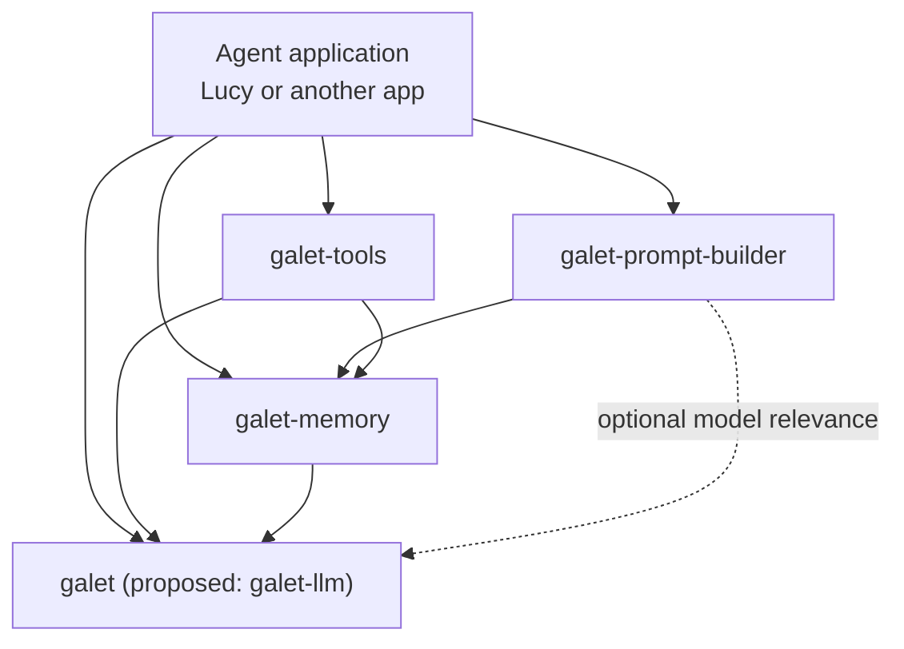

# Galet package responsibilities

Galet is a set of composable libraries beneath an agent application. Lucy is one such application; another developer can build a different agent without importing Lucy. The application defines its agents, runs, orchestration, permissions, configuration, and user experience. Each Galet package owns reusable behavior behind its public API.

The PyPI package and repository are currently named `galet`; `galet-llm` is a proposed clearer name, not a completed rename.

The diagram shows the intended capability dependencies. An application may use a subset of packages. It does not imply that every tool requires memory or that every prompt compilation calls a model.

## Responsibilities

| Package | Owns | Does not own |
| --- | --- | --- |
| [galet](https://github.com/junwin/galet) | Provider-facing interfaces and adapters for model requests, multimodal inputs and outputs, embeddings, and the model-facing tool-call contract. | Agents, run orchestration, memory policy, tool authorization. |
| [galet-memory](https://github.com/junwin/galet-memory) | Memory models and APIs, persistence implementations, retrieval and ranking, digest generation and archive semantics. | Prompt assembly or application-specific agent policy. |
| [galet-prompt-builder](https://github.com/junwin/galet-prompt-builder) | Compiling caller instructions, current input, and selected memory into bounded provider messages; relevance thresholds, token budgets, selection metrics. | Memory storage, digest generation, application orchestration. |
| [galet-tools](https://github.com/junwin/galet-tools) | Handler contract and registry, generic actions and adapters, discovery, and optional MCP exposure of configured tools. | Agent identity, permission policy, independent memory algorithms. |

## Memory behavior

**Episodic memory** records sessions and events, retrieves recent or filtered history, and manages archive boundaries and session digests. An archive should select the eligible events, generate and persist a digest, and advance the boundary as one coherent operation. Older events remain available for explicit historical retrieval. The present sample CLI accepts caller-supplied digest text; package-owned generation and atomic archiving are an architectural target, not a claim that this API is complete.

**Semantic memory** recalls relevant material using embeddings. Material may originate in selected events, digests, external files such as Markdown, or derived document digests. Those are indexable sources, not separate memory systems. Retrieval returns candidates with identifiers, scores, scope, and provenance.

**Procedural memory** supplies durable project or domain context and reusable skills. Context should support explicit scopes or nested namespaces, such as global, account, and project. Skills and context should remain usable independently of Lucy.

**Working memory** holds temporary run or task state, such as a plan or an agent handoff. Its lifetime and access rules differ from durable procedural instructions; it should be modeled separately.

Memory owns retrieval and ranking. Prompt builder chooses which returned candidates fit the request's relevance thresholds and token budgets. An application can use memory directly through a CLI, a tool, or another workflow without invoking prompt builder.

## Behavior and authority

| Behavior | Invocation and policy | Implementation |
| --- | --- | --- |
| Call a model | Application or calling package | galet normalizes provider calls |
| Record an event | Application run loop | galet-memory validates and persists |
| Archive a session | Application, user command, or configured policy | galet-memory selects events, generates a digest, and records the boundary |
| Recall memory | Prompt builder, tool, or application | galet-memory retrieves and ranks |
| Build a prompt | Application supplies request and budgets | galet-prompt-builder selects and assembles messages |
| Run a tool | Application authorizes and invokes | galet-tools dispatches to a handler |

A memory tool delegates to galet-memory rather than duplicating its search or archive logic. The presence of a handler in a registry or MCP server does not grant an agent permission to use it. The host application selects exposed capabilities and enforces authority.

## Scope and lifecycle

| Material | Typical scope | Lifetime |
| --- | --- | --- |
| Skill | Global, account, project, or agent | Durable and versioned |
| Project or domain context | Project, optionally account-specific | Durable and editable |
| Working context | Run or task | Temporary |
| Session event | Session and account | Durable |
| Session digest | Session and archive range | Durable and derived |
| External document | Namespace and account | Source-backed |

The interfaces should carry scope and provenance explicitly so retrieval and access rules do not depend on naming conventions.

## Integration test for the boundaries

A small application outside Lucy should be able to define an agent and run loop, call a model with galet, register selected galet-tools handlers, record and recall through galet-memory, and optionally compile prompts with galet-prompt-builder. If that application must import Lucy or reimplement digest, retrieval, or handler behavior, the responsibility boundary needs further work.

This document states the intended package boundaries. Repository READMEs and public APIs remain the source for currently implemented features.
